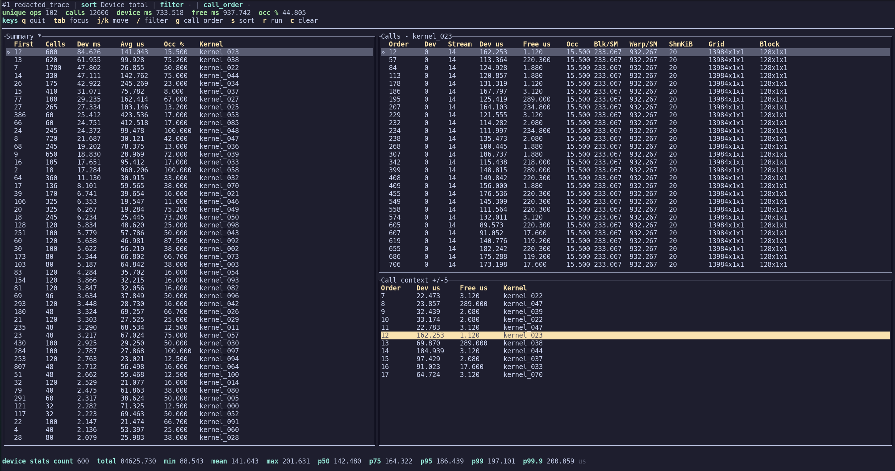

# GPU Trace Viewer

Rust terminal and web viewer for GPU trace statistics stored in SQLite.

The `gpu-trace-viewer` binary imports trace JSON/GZ files or calls CSV files directly into
`gpu_trace_stats.sqlite`, then opens the same data in the TUI, web UI, or CLI reports.

## Preview



## Install

```bash
cargo install --path . --force
```

This installs `gpu-trace-viewer` into `~/.cargo/bin`.

## Fish Completion

```bash
mkdir -p ~/.config/fish/completions
gpu-trace-viewer completions fish > ~/.config/fish/completions/gpu-trace-viewer.fish
```

## Commands

```bash
gpu-trace-viewer --db ../gpu_trace_stats.sqlite import-trace --label before /path/to/profile.trace.json.gz
gpu-trace-viewer --db ../gpu_trace_stats.sqlite import-csv --label before /path/to/calls.csv
gpu-trace-viewer --db ../gpu_trace_stats.sqlite
gpu-trace-viewer --db ../gpu_trace_stats.sqlite delete-run 4
gpu-trace-viewer --db ../gpu_trace_stats.sqlite tui --summary-limit 500 --calls-limit 500
gpu-trace-viewer --db ../gpu_trace_stats.sqlite serve --host 127.0.0.1 --port 8766
gpu-trace-viewer --db ../gpu_trace_stats.sqlite runs
gpu-trace-viewer --db ../gpu_trace_stats.sqlite top --by first --limit 10
gpu-trace-viewer --db ../gpu_trace_stats.sqlite calls --call-order 10
gpu-trace-viewer completions fish
```

If `--db` is omitted, the binary looks for `gpu_trace_stats.sqlite` in the current directory and then `../gpu_trace_stats.sqlite`.
If no subcommand is provided, the binary opens the TUI.
Import commands create the SQLite database if it does not already exist.

## TUI Keys

- `q`: quit
- `Tab`: switch between Summary and Calls
- `j/k` or arrow keys: move selection
- Moving the Summary selection automatically loads that kernel's calls
- `Enter`: switch from a selected summary op to the Calls panel
- `/`: edit kernel-name filter
- `g`: query exact call order
- `s`: cycle summary sort
- `r`: switch run
- `c`: clear filter, selected op, and call-order query

Selecting a call row automatically shows the `call_order +/- 5` context panel.
The Calls panel title shows the selected kernel or exact `call_order` query.
The bottom stats row shows device-time count, total, min, mean, max, p50, p75, p95, p99, and p99.9 for the current Calls query.

## Web Server

The Rust web server reuses the same SQLite import/query/delete layer as the TUI and exposes:

- Browser controls for importing a trace JSON/GZ path or calls CSV path
- Browser deletion for the selected run
- `/api/runs`
- `/api/import-trace` via `POST {"trace": "/path/to/file.trace.json.gz"}`
- `/api/import-csv` via `POST {"csv": "/path/to/calls.csv"}`
- `/api/summary`
- `/api/calls`
- `/api/call-context`
- `/download/summary.csv`
- `/download/calls.csv`
- `/api/delete-run` via `POST {"run_id": N}`

Import and delete are available directly from the `gpu-trace-viewer` binary.
